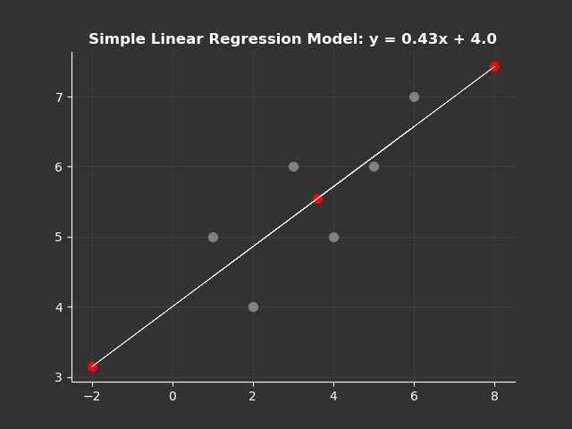
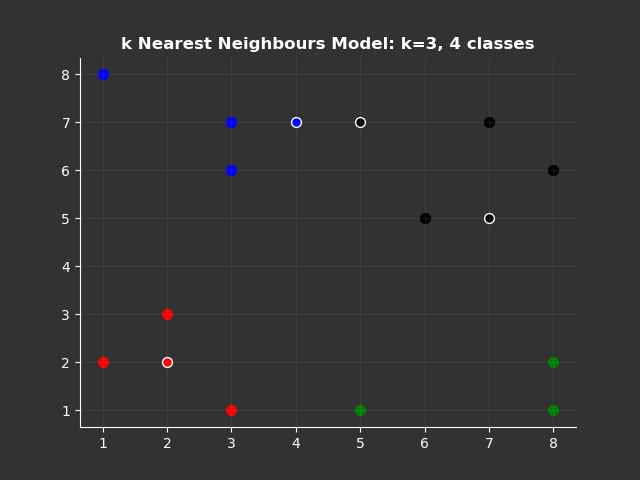
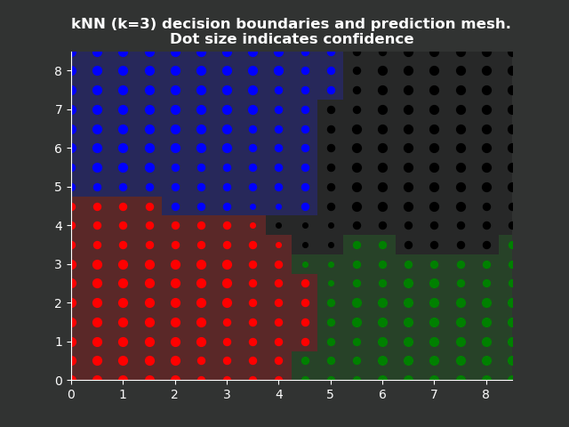
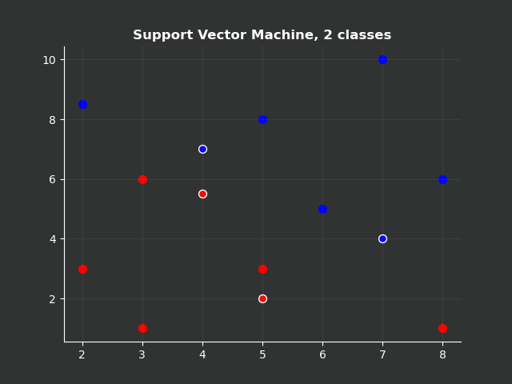
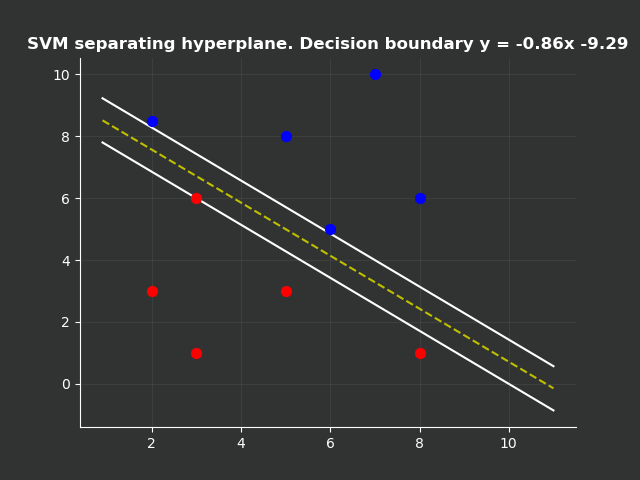
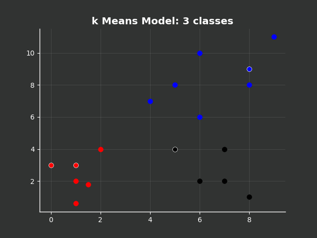
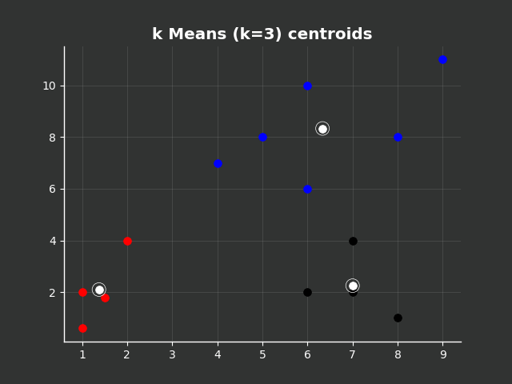
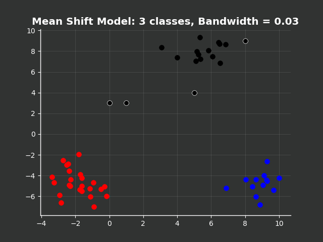
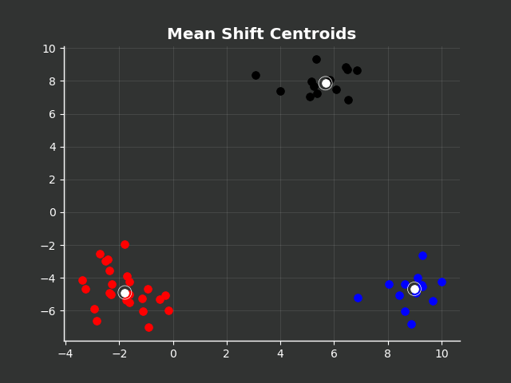

# Machine Learning Algorithms from Scratch
This repository contains a collection of Machine learning algorithms developed from scratch within Python.

## Contents

  
Table of Contents

  <ol>
    <li><a href="#project-description"> ➤ Project Description </a></li>
    <li><a href="#folder-structure"> ➤ Folder Structure</a></li>
    <li><a href="#setup-and-usage"> ➤ Setup and Usage</a></li>
    <li>
      <a href="#algorithms"> ➤ Algorithms</a>
      <ul>
        <li><a href="#simple-linear-regression">Simple Linear Regression</a></li>
        <li><a href="#k-nearest-neighbours">k Nearest Neighbours</a></li>
        <li><a href="#support-vector-machine">Support Vector Machine</a></li>
        <li><a href="#k-means">k Means</a></li>
        <li><a href="#mean-shift">Mean Shift</a></li>
      </ul>
    </li>
    <li><a href="#inspiration"> ➤ Inspiration</a></li>
  </ol>

## Project Description
Python implementation of a variety of Machine Learning (ML) algorithms from scratch, drawing <a href="#inspiration">inspiration</a> from various tutorials and training courses. This work involves the application of Object-Oriented Programming to produce supervised and unsupervised ML models, with the neccessary testing completed in order to demonstrate performance. Each ML algorithm is represented as an object that includes fit, predict and visualise methods to not only provide the functionality, but give the user a visual reprensetation of the statistical methods applied.

## Folder Structure

    ml-algorithms-from-scratch
    │
    ├── datasets
    │   ├── breast-cancer-wisconsin.data
    │   ├── breast-cancer-wisconsin.names
    │ 
    ├── ml_algorithms
    │   ├── __init__.py
    │   ├── k_means.py    
    │   ├── k_nearest_neighbours.py
    │   ├── linear_regression.py
    │   ├── mean_shift.py
    │   ├── support_vector_machine.py
    │ 
    ├── model_testing 
    │   ├── images
    │   │   ├── ___.png
    │   ├── k_means_testing.py    
    │   ├── k_nearest_neighbours_testing.py
    │   ├── linear_regression_testing.py
    │   ├── mean_shift_testing.py
    │   ├── support_vector_machine_testing.py
    │ 
    ├── LICENSE 
    │ 
    ├── README.md 

## Setup and Usage

The following open source packages are used in this project:
* Numpy
* Matplotlib
* Scikit-Learn
* Random
* Warnings
* Collections
* Sys
* OS

The ML algorithms that have been developed are contained within a package named <a href="https://github.com/jakeyk11/ml-algorithms-from-scratch/tree/main/ml_algorithms">ml_algorithms</a>. Given that the package has not yet been formally deployed, it is advised that the user takes the following steps:
<ol>
  <li>Clone the project and save to a local area</li>
  <li>Add the ml_algorithms directory to the environment path</li>
  <li>Import the required machine learning algorithm</li>
</ol>

For example, to load the linear regression algorithm when working within the <a href="https://github.com/jakeyk11/ml-algorithms-from-scratch/tree/main/model_testing">model_testing</a> directory, the following code may be written within Python:

    import os
    import sys
    root_folder = os.path.abspath(os.path.dirname(os.path.dirname(os.path.abspath(__file__))))
    sys.path.append(root_folder)
    
    from ml_algorithms.linear_regression import LinearRegression

For convenience, the project directory contains an area to store data (<a href="https://github.com/jakeyk11/ml-algorithms-from-scratch/tree/main/datasets">datasets</a>) and an area to test ML algorithms (<a href="https://github.com/jakeyk11/ml-algorithms-from-scratch/tree/main/model_testing">model_testing</a>).

## Algorithms

### Simple Linear Regression

Straightforward approach for predicting a quantitative response on the basis of a single predictor variable, with an assumption that there is an approximately linear relationship between response and predictor. Required inputs are: (i) training data and (ii) specification of whether to force the y-intercept of the linear model to zero. 

**Example:** The linear regression model (with non-zero y-intercept) was fit to six points in the cartesian co-ordinate space (grey points). The result is a linear model of form y = mx + c, which is then used to predict the response for three features (red points.)

   &nbsp &nbsp

### k Nearest Neighbours

Classification model that; identifies the k points in the multi-dimensional training data that are closest to the test point (by euclidean distance), estimates the conditional probability that the test point belongs to each class, and then assigns the test point to the class with the largest probability. Required inputs are: (i) training data and (ii) number of nearest neighbours to use for classification, k.

**Example:** The kNN classification model (with k=3) was used to classify four features (points with white outlines) to one of four classes (represented by red, black, green and blue points) in the cartesian co-ordinate space. The kNN visualise method was used to classify a generic grid of test points and show decision boundaries. Note that the size of the test points represent the confidence with which classifications were made.

   &nbsp &nbsp
   &nbsp &nbsp

**Example:** The kNN classification model (with k=3) was applied to the breast cancer wisconsin dataset to classify tumours as benign or malignant based on a number of predictors. An accuracy of 98.5% demonstrated the model capability in a multi-dimensional problem space.

### Support Vector Machine

Two-class classification model that uses optimisation techniques to generate the hyper-plane that best separates the two classes. Given the mathematical complexity of SVMs, this implementation is limited to a linear separation of two-dimensional data. Required inputs are: (i) training data.

**Example:** The SVM classifier was fit to two classes, represented by red and black points, and then used to classify four features (points with white outlines). The SVM visualise method was used to show the separating hyperplane and decision boundary that was generated to perform classification.

   &nbsp &nbsp
   &nbsp &nbsp

### k Means

Flat unsupervised classification model that partitions a dataset into k distinct, non-overlapping clusters. Based on a pre-defined number of clusters, centroids are randomly positioned and features clustered based on the centroid to which they are closest. Centroids are re-positioned at the mean locations of the new clusters, and this process is repeated until the centroids move within a defined tolerance. Required inputs are: (i) training data, (ii) number of clusters, k, (iii) tolerance below which centroids must move for a solution to be considered converged and (iv) maximum number of iterations permitted.

**Example:** The k Means classifier (k = 3) was used to classify four features (points with white outlines) to one of three clusters (represented by red, black and blue points) in the cartesian co-ordinate space. The k Means visualise method was used to show the cluster centroids that were used to perform classification.

   &nbsp &nbsp
   &nbsp &nbsp

### Mean Shift

Hierarchical unsupervised classification model based on kernel density estimation, with an assumption that data is sampled from an underlying probability distribution. Every feature is initially defined as a cluster centre with an associated bandwidth. Other features within the bandwidth are identified and the mean position used to define new cluster centers, and this process is repeated until the centroids move within a defined tolerance. Required inputs are: (i) training data, (ii) bandwidth for grouping features, (iii) step-size for application of dynamic bandwidth, (iv) tolerance below which centroids must move for a solution to be considered converged and (v) maximum number of iterations permitted.

**Example:** The Mean Shift classifier was used to classify four features (points with white outlines) to clusters that the algorithm had identified in the cartesian co-ordinate space. The Mean Shift visualise method was used to show the cluster centroids that were used to perform classification.

   &nbsp &nbsp
   &nbsp &nbsp

## Inspiration

<ul>
  <li>
    
 G. James, D. Witten, T. Hastie & R. Tibshirani. An Introduction to Statistical Learning, with Applications in R. 2nd Ed. Springer, 2021 

  </li>
  <li>
    

      H. Kinsley. 'Practical Machine Learning with Python', 2017 [online]. Available: https://pythonprogramming.net/machine-learning-tutorial-python-introduction/ 
    

  </li>
  <li>
    

      H. Kinsley & D. Kukiela. Neural Networks from Scratch, 1st Ed. Harrison Kinsley, 2020
    

  </li>
    <li>
    

      H. Kinsley. 'Neural Networks from Scratch in Python', 2021 [online]. Available: https://www.youtube.com/playlist?list=PLQVvvaa0QuDcjD5BAw2DxE6OF2tius3V3
    

  </li>
</ul>
